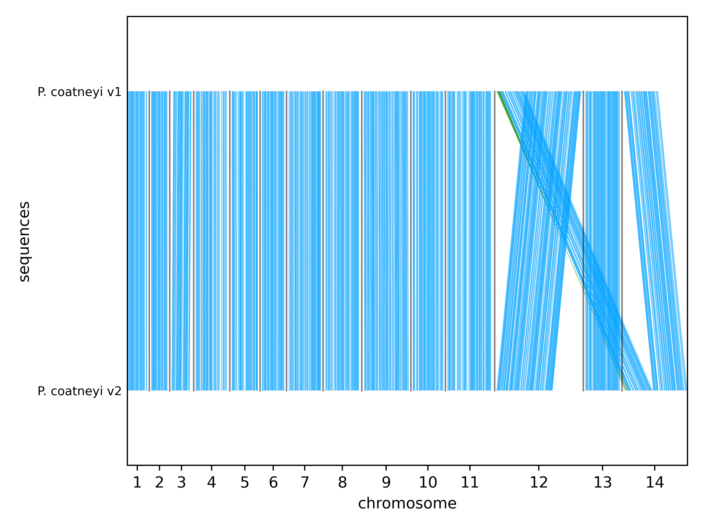
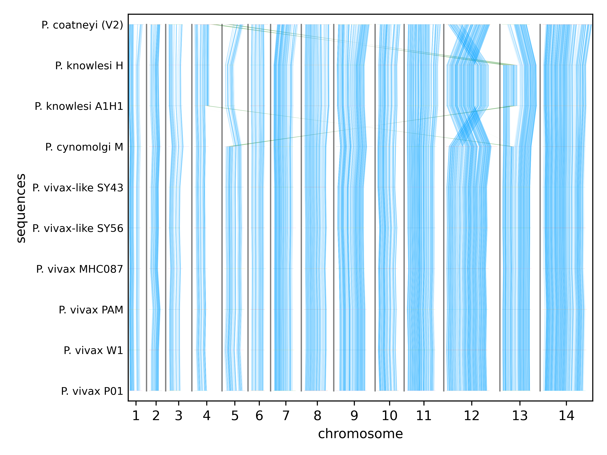

# Macro-evolutionary Pangenomics: A *Plasmodium* Case Study

This repository documents a case study testing the capabilities of population-level pangenomics tools (**MUM&Co** and **PGGB**) in a macro-evolutionary context.

We analyzed the "monkey clade" of *Plasmodium*, focusing on the structural differences between species and assessing genome assembly quality.

## Dataset

The analysis includes **10 genomes** from the *Plasmodium* monkey clade:

* ***P. coatneyi* (Hackeri):** Used for assembly QC (comparison of V1 PacBio unpolished vs. V2 Hybrid polished).
* ***P. knowlesi*:** H , A1H1.
* ***P. cynomolgi*:** M.
* ***P. vivax*:** MHC087, PAM, W1, P01.
* ***P. vivax*-like:** SY43, SY56

## Tools Used

1.  **MUMento** (v1.3.4): For whole-genome alignment and synteny.
2.  **PGGB** (v0.7.2): For variation graph construction.

---

## 1. MUMento Analysis

### *P. coatneyi* Assembly Comparison (V1 vs V2)
We compared the 2016 PacBio-only assembly (V1; [Chien et al., 2016](https://doi.org/10.1128/genomeA.00883-16)) against the V2 update (polished with Illumina).

* **Results:** The alignment shows identical collinearity for most chromosomes (except corrections in Chr 12 and 14). However, we observe high "fragmentation" (variation) in the alignment. This is not structural variation but rather the massive correction of indels introduced by the polishing step. This confirms the qualitative superiority of the V2 assembly.

*(Fig 1: High collinearity with indel-driven fragmentation)*

### Clade-level Synteny
We ran an all-vs-all comparison across all species.

* **Results:** MUMento provided very granular synteny results, outperforming gene-centric tools like GENESPACE (R package). We were able to detect syntenic blocks in both intergenic and intragenic regions.

*(Fig 2: Granular synteny across the clade)*

---

## 2. PGGB Analysis

### Variation Graphs & Assembly Errors
Using Bandage to visualize the graph topology between *P. coatneyi* V1 and V2:

* **Observation:** The graph forms "bubbles" (diverging paths) representing sequence variation. These bubbles are heavily concentrated in **intergenic and intronic regions**.
* **Implication:** This indicates that the unpolished long-read assembly (V1) contains significant errors in low-complexity/repetitive regions, which are resolved in V2.

### Global Pangenome (>90% Identity)
We built a graph with a 90% identity threshold to identify deep homology.

* **Core Genome:** Successfully identified conserved structural elements (centromere cores, RNA loci).
* **Variable Regions:** The "shell" of the pangenome is enriched with multigene families (host-parasite interaction), showing where the species diverge most.

[See slides PDF](./figures/pdf1.pdf)

---

## Tool Comparison & Conclusions

We evaluated both tools for their utility in macro-evolutionary studies:

### MUMento
* **Pros:** Very fast, easy to install, great for global synteny visualization.
* **Cons:** Hard to extract raw data for downstream analysis; cannot easily identify unique paths (e.g. telomeres).

### PGGB
* **Pros:** Excellent data extraction, customizable, compatible with Bandage for graph viz, detects unique paths.
* **Cons:** Computationally intensive (speed depends heavily on data size).

**Summary:**
While these tools are designed for microevolutionary analisys, they are highly effective for inter-species analysis. **MUMento** is ideal for quick synteny checks, while **PGGB** is better suited for deep structural analysis and dissecting complex gene families.
